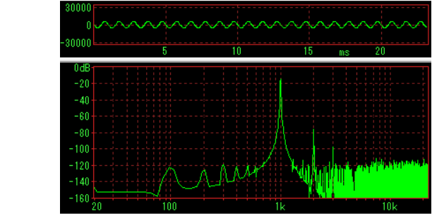
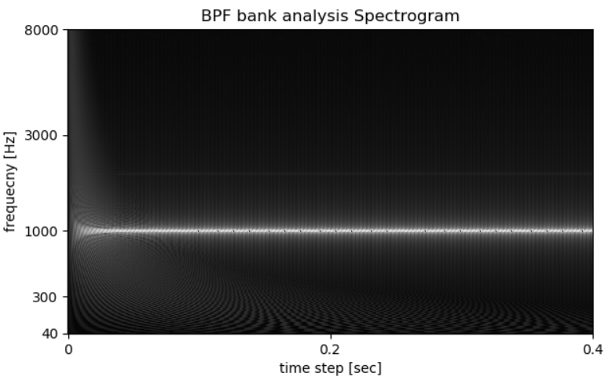
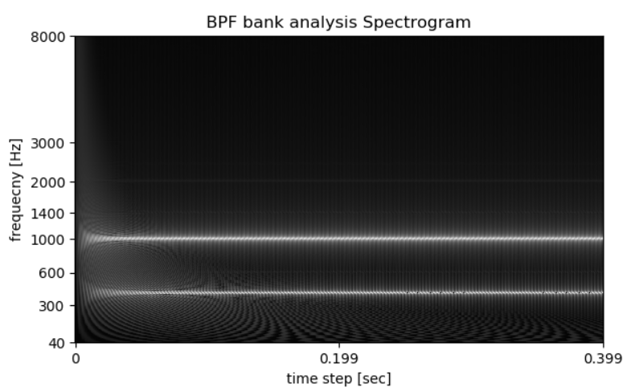
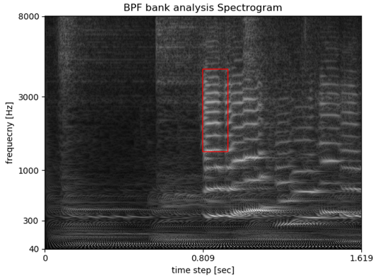
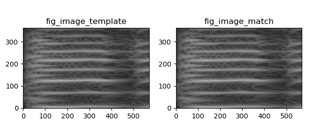
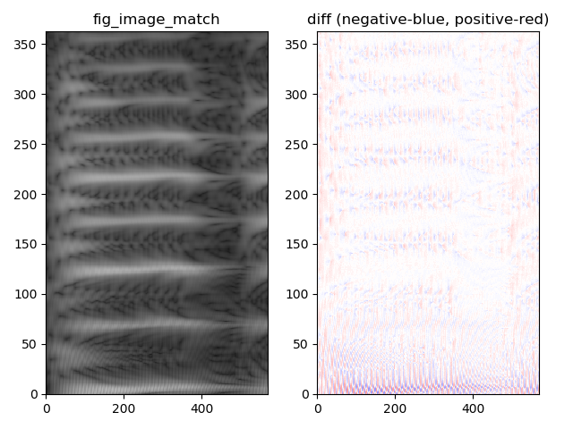
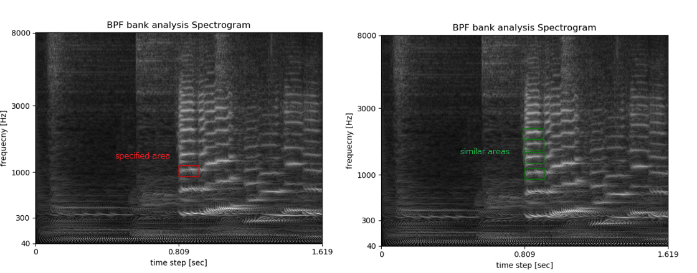
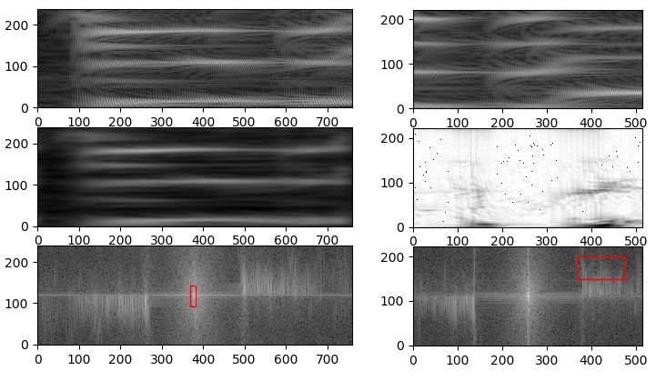

#  BPF bank analysis Spectrogram  
    
Spectrogram analysis of Tube Amplifier Distortion (PC simulation)  
   
[github repository](https://github.com/shun60s/Harmonic/)  
  
  
## feature  

- BPF's target response is 2nd harmonic level less than -70dB
- Mel-frequency division
- Half-wave rectification until a few KHz signal or DC with ripple signal
- Down sampling to decrease temporal resolution
- N-th root compression

## description  

- BPF_analysis1.py BPF bank analysis Spectrogram main program
- BPF4.py IIR Band Pass Filter, process twice. Target response is 2nd harmonic level less than -70dB
- Compressor1.py compressor by power(input,1/3.5), 3.5 root compression 
- ema1.py Exponential Moving Average with Half-wave rectification, and smoothing via lpf
- iir1.py iir butterworth filter
- mel.py mel-frequency equal shifted list
- compare_spectrograms1.py main program, compare matching portion of two spectrograms and show its difference
- search_similar_area1.py main program, search some similar area near the specified area in spectrogram
- Spectrogram_2D-FFT.py main program, show Spectrogram, 2D inverse FFT, and 2D FFT of the spectrogram
- in the wav folder, there are used wav files.  

## analysis of Tube Amplifier Distortion (PC simulation)  

### Input signal is 1KHz -10dB sin wave  

FFT spectrum of 1KHz-10dB_44100Hz_400ms-TwoTube_stereo.wav. There are 2nd harmonic(2KHz) and 3rd harmonic(3KHz).  
  
  
BPF_analysis1.py output. Dark white line in the mid area shows 2nd harmonic(2KHz). Bright white line shows 1KHz.  
Start wave pattern is filter transient response.  
  

### Input signal is mix of 400Hz -10dB sin wave and 1KHz -10dB sin wave  

FFT spectrum of Mix_400Hz1KHz-10dB_44100Hz_400msec_TwoTube_mono.wav.  There are 600Hz, 1400Hz, etc other than 800Hz, 2KHz, 1600Hz and 3000Hz.   
  

BPF_analysis1.py output. Dark white lines show 600Hz, 1400Hz, and 2KHz.  
  

## Compare matching portion of two spectrograms  

A music spectrogram comparison of input and output of Tube Amplifier (PC simulation).  

Matching portion (red rectangle area) in the template spectrogram  to compare.  
Set diagonal position by pointing-device mouse and exist figure. Matching portion in the matching spectrogram will be detected by cv2.matchTemplate function.  
  

each matching portion of template spectrogram and matching spectrogram  
  

matching portion and its difference (red means positive  and blue means negative)    
  

## Search some similar area near the specified area in spectrogram  

Specify the area as diagonal position by pointing-device mouse. And then, click right mouse button or press m on keyboard.  
  

## Spectrogram, 2D FFT, and 2D inverse FFT

In the following figure, from top to bottom, spectrogram, 2D inverse FFT of red rectangle in 2D FFT, and 2D FFT of the spectrogram.  

  

## License  

MIT  

Regarding to nms.py, please refer copyright and license notice in the content.  

